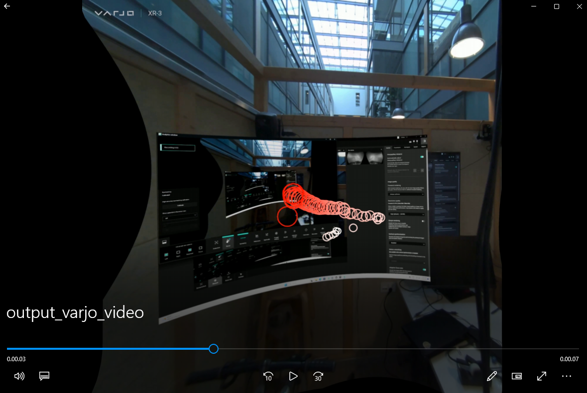

# Varjo Gaze Tracking Visualization

This project processes and visualizes gaze tracking data from Varjo headsets. It overlays gaze points onto a video recorded from the Varjo display, drawing markers that represent where the user is looking. The gaze data is extracted from CSV files generated by the Varjo Base software.

## Features

- Extract gaze tracking data from Varjo CSV files
- Overlay gaze points onto a video
- Draw the last 50 gaze points with varying red intensity (adjustable)
- Normalize gaze coordinates and map them to the video screen
- Generate an output video with visualized gaze markers

## Requirements

To run this project, you'll need the following:

- Python 3.x
- OpenCV
- NumPy
- Pandas

Install dependencies using `pip`:

```bash
pip install opencv-python numpy pandas
```

## Usage

1. **Prepare the video and gaze data**:
   - Record a video using a Varjo headset.
   - Export gaze tracking data from Varjo Base in CSV format.

2. **Run the script**:
   - Place your video and gaze data CSV in the project directory.
   - Update the file paths in the script as needed.

3. **Command to run the script**:
   ```bash
   python gaze_visualization.py
   ```

4. **Result**:
   - The script will generate a new video with gaze markers drawn on it, highlighting where the user was looking during the recording.

## File Structure

```plaintext
.
├── Case1\varjo_video.mp4         # Input video recorded from Varjo display
├── Case1\varjo_gaze_output.csv         # CSV file containing gaze tracking data
├── VarjoGazeVisualization.py         # Main script to process and visualize gaze data
├── output_video_with_gaze.mp4    # Output video with gaze markers
└── README.md                     # Project documentation
```

## Gaze Data Format

The CSV file generated by Varjo Base contains normalized gaze coordinates in the range `[-1, 1]`, where:

- `(0, 0)` is the center of the screen
- `(-1, -1)` is the bottom-left corner
- `(1, 1)` is the top-right corner

### Key CSV Columns:
- **relative_to_video_first_frame_timestamp**: Timestamp for each gaze sample.
- **gaze_x**: Normalized horizontal gaze position.
- **gaze_y**: Normalized vertical gaze position.

## Example Output



The output video shows gaze points drawn as circles at each frame, where the user's gaze was focused. The last 50 (variable) gaze points are drawn with decreasing red intensity to show a trail of where the user was recently looking.

## License

This project is licensed under the MIT License. See the [LICENSE](LICENSE) file for details.

## Acknowledgments

Special thanks to Varjo for providing the tools for gaze tracking and visualization.
